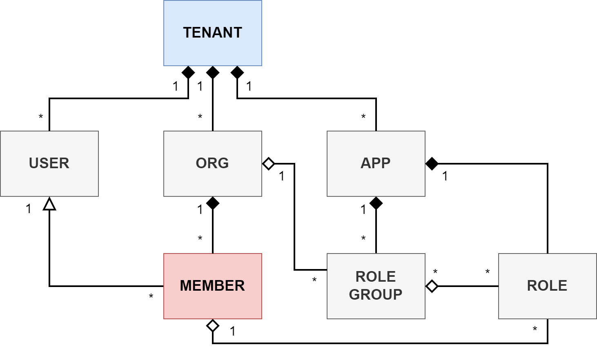

# How it works

Transmit implements a tenant-based model that includes organizations, users, and applications. You can manage multiple tenants, each serving a separate set of organizations and apps. 

What brings the tenant-based model together is user memberships and role-based access controls: typically, a user needs to be an organization member to have access to apps' roles and permissions. 

The functionality is available both through the Admin Portal and via the APIs.  

## About organizations 

### Organizations

Organizations represent your business customers or partners. For instance, a food delivery service might give restaurants and kitchens special access to their app so they can see orders and send out deliveries.  

Organizations are created on the tenant level; each organization can be granted access to one or more applications.  

You can manage organizations via our APIs or through the Admin Portal. In addition to this, we provide special tools like dedicated APIs and self-service portals so the organizations can control their own memberships if they want. 

### Members  
 
Members are the people who belong to an organization, like customers or employees. For example, think about a ride-sharing app that tells drivers about new rides or any order changes. These drivers are the members of the organization.

You can add members to an organization in multiple ways:

- They can sign up via your app (that uses our APIs).   
- You can invite them through email. 
- They can log in through an external provider (Google, Okta, etc).  

There is difference between a user and a member (we recognize the users by the `user_id` value). A user may have memberships in multiple organizations. Therefore, we uniquely identify a member by the `user_id` + `org_id` combination.  

Plus, a user can log in either directly using their personal account (if the app allows B2C scenarios), or they can log in within the context of organization they belong to. 

### Authentication  

An application can authenticate members in several ways. They can:

- Use the app's internal authentication providing you pass the `org_id` value in the request.  
- Allow the organization to configure a custom OIDC or SAML identity provider (IDP). If a third-party IDP is used, the member will need to have an email address that matches the organization's domain.  
 
### Access control  

An organization can control the access of members to the application by assigning roles. For additional information, see [Role-based access](/guides/b2b/b2b_how_rbac.md).  

## Role-based access  

Role-based access control (RBAC) is a technique for restricting system access based on the user roles. Each user in granted one or multiple roles and each role is assigned permissions. These permissions determine the user's level of access to your application. 

For example, a retail website can display different pricing models to buyers and consumers, while a payment app may expose more sensitive business data to partners than to customers. 

### Roles and permissions  

In your app, you can create roles that are specific to the application; for each role, you can define the permissions the role provides. For example, in a food delivery app, you may have a Kitchen Assistant role that is granted permission to view the upcoming orders and check the locations of dispatched orders on a map.  

These roles determine what members can do once they log in. You can retrieve member roles directly through an API request or have them included in access/ID tokens when users successfully authenticate.

### Role groups   

Roles are typically assigned by organizations, but applications have control which roles the organizations can choose from.  

The application creates role groups with specific sets of roles and then assigns role groups to organizations. This means the organizations can only choose from roles that belong to the assigned role groups.  