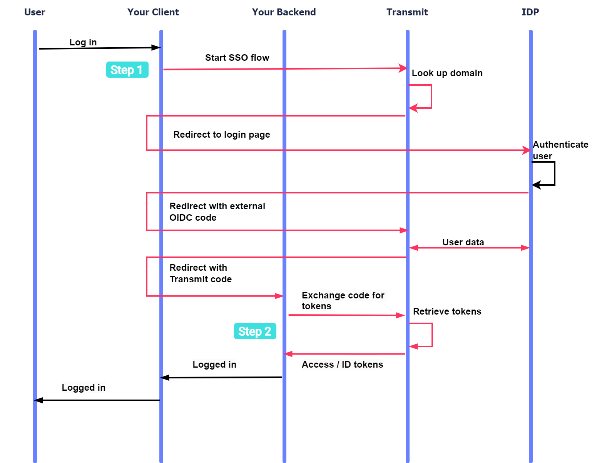
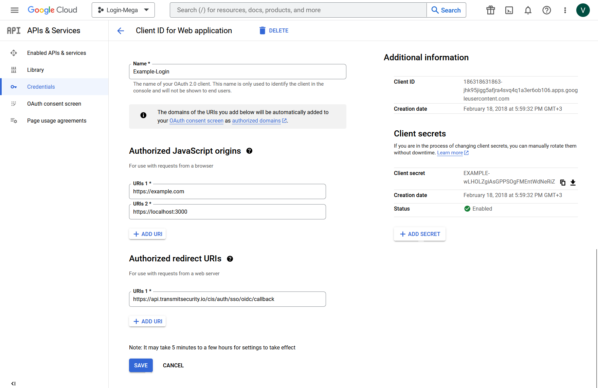
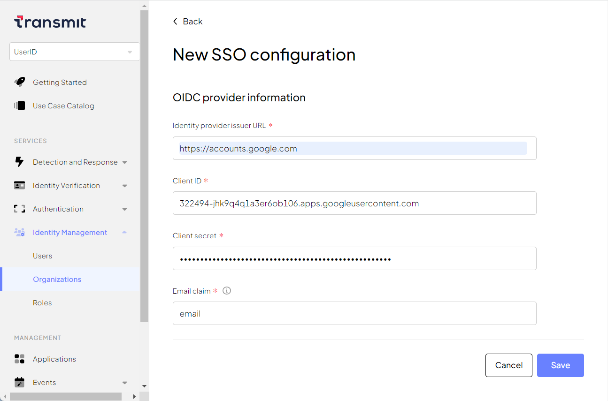

# Federate SSO through OIDC

With our platform, you can federate single sign-on (SS0) through third-party OIDC providers. 

[Open ID Connect](https://openid.net/developers/discover-openid-and-openid-connect/) (OIDC) is an extension that provides an identity layer on top of [OAuth 2.0](https://oauth.net/2/) authorization framework. OIDC is commonly used to federate authentication and identity management, as well as to enable single sign-on (SSO) across different applications and organizations.  

Transmit supports identity federation through external OIDC identity providers (IDPs). For example, B2B apps can allow your business customers or partners to provide SSO login for their members. This simplifies identity management and gives users a seamless identity experience.  

## How it works

Here's an example OIDC flow that you can implement. Interactions with Transmit are highlighted in pink; the diagram also shows where the integration steps come into play:  

  

1. A user wants to login; your app requests to start an SSO login flow.
2. If the user is a member of an organization configured for OIDC SSO, Transmit redirects to the OIDC Identity Provider.
3. After authenticating the user, the IDP redirects to Transmit backend with OIDC code.
4. Transmit gets user data from the IDP. 
5. Transmit redirects to your backend with its code. 
6. Your backend exchange the code for the access/ID tokens.  

## Before you start

Before a B2B app can use OIDC SSO to login users, the tenant must have the following B2B configurations in place:  

- [Application]() - representing the B2B app, and must integrate OIDC SSO (see steps 1-2 below)  
- [Organization]() - representing business customers or partners, and assigned to the app  
- [Members]() - users that are created or added as members of the organization.  

!!! note
    Each member must have a primary email address at the organization's domain.  
    Members must be assigned to the app, unless the app is enabled for public sign-ups, in which case the user is added automatically to the app upon their initial login. 

## Step 1: Start OIDC SSO  

Your B2B app should invoke the OIDC SSO flow when a user requests to log in by navigating to `/v1/auth/sso/start` in a browser. This sends a [GET request like this](/openapi/user/sso/#operation/startSsoLogin):  

```js
https://api.transmitsecurity.io/cis/v1/auth/sso/start?
client_id=CLIENT_ID& // Client ID (B2B app settings).  
email=EMAIL& // User's email address. The domain must correspond to the OIDC SSO configurations. 
redirect_uri=REDIRECT_URI // Transmit redirects to this URI after completing this request.  
```

If the email domain corresponds to an organization that's configured for OIDC SSO, the user is redirected to the configured OIDC identity provider. Otherwise, an error is returned and the app can proceed with a regular authentication flow.  

## Step 2: Complete the login  

To complete the login, your B2B app should create an endpoint that gets user tokens. This endpoint should accept `code` as a query parameter, and be configured as an allowed redirect URI in the Transmit Admin Portal.

Once invoked, it should send an [`/oidc/token`](/openapi/user/oidc/#operation/oidcToken) request like the one below to exchange the code for user tokens. 
For improved security, [validate the tokens](/guides/user/validate_tokens/). The ID token includes the organization and the email of the user that completed the authentication; make sure this matches the user email you requested.  

```js
import fetch from 'node-fetch';

async function run() {
  const resp = await fetch(
    `https://api.transmitsecurity.io/cis/v1/oidc/token`,
    {
      method: 'POST',
      headers: {
        'Content-Type': 'application/json'
      },
      body: JSON.stringify({
        code: '[CODE]', // Code returned to your redirect URI
        client_id: '[CLIENT_ID]', // Client ID found in your app settings
        client_secret: '[CLIENT_SECRET]' // Client secret found in your app settings
      })
    }
  );

  const data = await resp.json();
  console.log(data);
}

run();
```

## Step 3: Configure your IDP account 


To login members using their own IDP, an organization must configure their IDP account to work with Transmit. Typically, this involves creating a client and configuring the redirect URI that users will be redirected to after authentication. The required parameters vary from provider to provider.  

For the IDP client, the organization should specify the following redirect URI value: `{{BASE_URL}}/auth/sso/oidc/callback` 

Also note the client ID and the client secret values the IDP normally generates upon saving the client. You will need them for SSO configuration.   

!!! note "Learn more"
    See [example Google IDP configurations](#google-idp-example). 


## Step 4: Add SSO configuration  

The OIDC SSO flow is initiated and completed by the B2B app on behalf of the organization.

Configure the organization for OIDC SSO in the Transmit system. You can do this from the organization's settings in the Admin Portal (**Identity Management** > **Organizations**). You'll need to obtain the details from the OIDC IDP (for example,from their documentation):  

- Basic parameters:  
    * SSO configuration name  
    * B2B application from the list  
    * SSO provider type: **OIDC Provider** 
- SSO configurations (see [example configurations for Google IDP](#google-idp-example)):  
    * **Identity provider issuer URL**: IDP's issuer URL  
    * **Client ID**: Client ID in the IDP account 
    * **Client secret**: Client secret in the IDP account  
    * **Email claim**: Name of the ID token claim that contains the user's primary email. Default value: `email`  


## Google IDP example  

<!-- This section is linked from an above section (Configure your IDP account). -->

To set up Google IDP, you need to go to [Google Credentials](https://console.cloud.google.com/apis/credentials), create an OIDC Client, and specify the following parameters:  

- **Authorized redirect URIs**: Enter the default value: `https://api.transmitsecurity.io/cis/auth/sso/oidc/callback`.
- **Authorized JavaScript origins**: Specify your production, staging, and/or development environments. Example development environment: `https://localhost:3000` (default for React JS).  

Google IDP generates new credentials (**Client ID** and **Client secret**) automatically. You can add new secrets after saving the OIDC client.  

  

For successful Google IDP OIDC SSO integration, you need to enter the following parameters:  

* **Identity provider issuer URL**: `https://accounts.google.com`. 
* **Client ID**: Your client ID with Google IDP.  
* **Client secret**: Your client secret with Google IDP. 
* **Email claim**: Use the default value: `email`.  

  