# Feed audit logs to Splunk

You can feed data to Splunk via [Transmit Security Events Add-on](https://splunkbase.splunk.com/app/6965) . This plugin will help you keep track of user and admin activity by polling [Audit Logs API](/openapi/risk/activities/).   

## Step 1: Configure a management app

In your Transmit Security tenant, [configure a management app](/guides/user/management_apps.md). Give the app a suitable name, for example, `MySplunkLogStream`.  

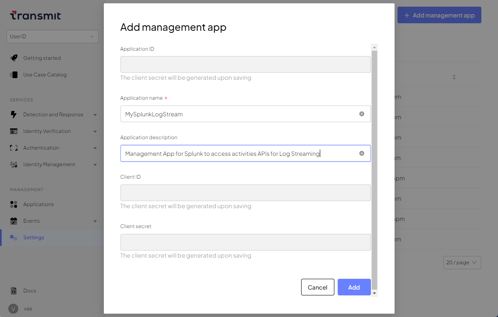 

!!! note
    After saving the management app, open it again and note the **Client ID** and **Client Secret** values. You’ll need these parameters to install the Splunk App.  

## Step 2: Install the plugin 

You have the following options:  

- Install the plugin directly from [Splunk portal](https://splunkbase.splunk.com). This option supports **both Splunk Enterprise and Splunk Cloud** environments.  
- Download the plugin and install it manually. This option only supports Splunk Enterprise environments and **doesn't work for Splunk Cloud** users. 

To install the plugin from Splunk portal:  

1. While logged in, go to **Apps** > **Manage Apps**, then click **Browse more apps**:  
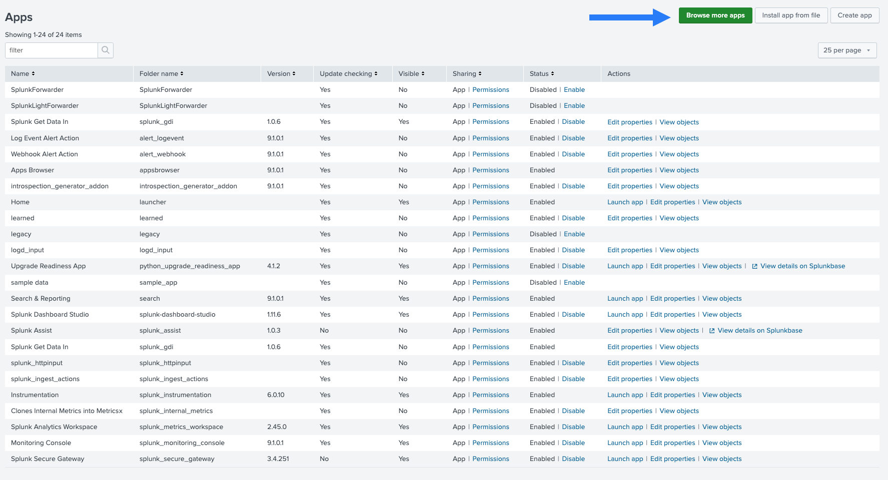  
2. Search for Transmit Security Events Add-on:  
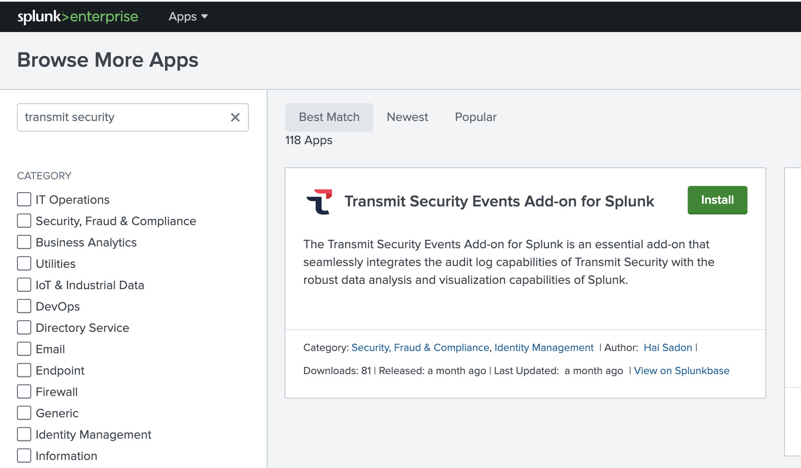  
3. Click **Install** on the **Transmit Security Events Add-on** tile. 
4. Log in with your Splunk username and password: 
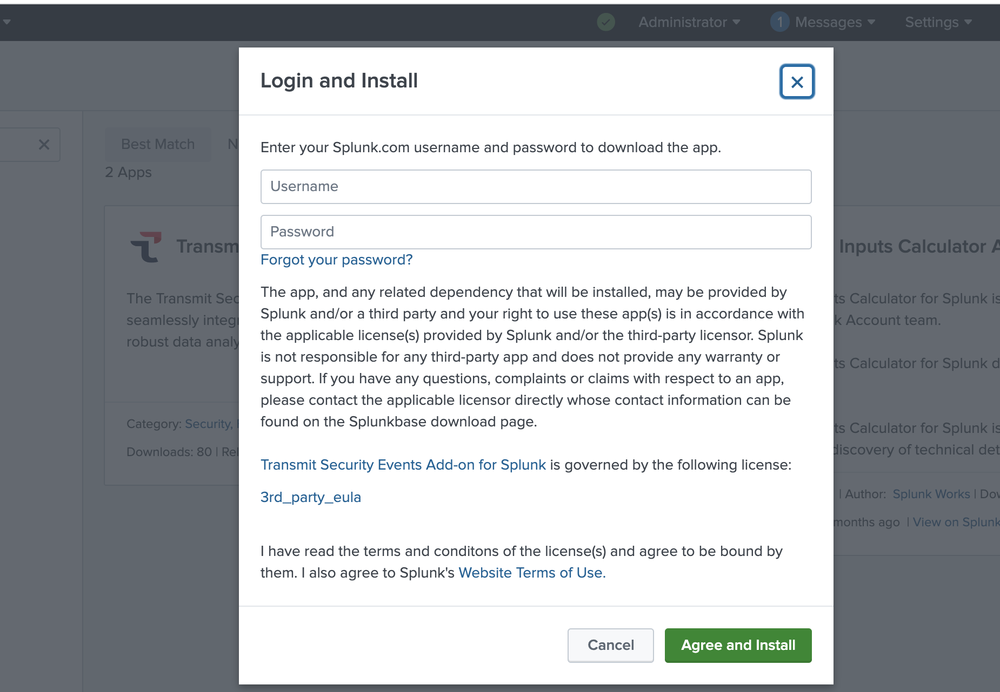  
5. Restart Splunk.  

To install the plugin manually (only in Splunk Enterprise environments): 

1. Download [Transmit Security Audit Log Connector for Splunk](https://splunkbase.splunk.com/app/6965). 
1. On Splunk portal, go to **Apps** > **Manage Apps**:   
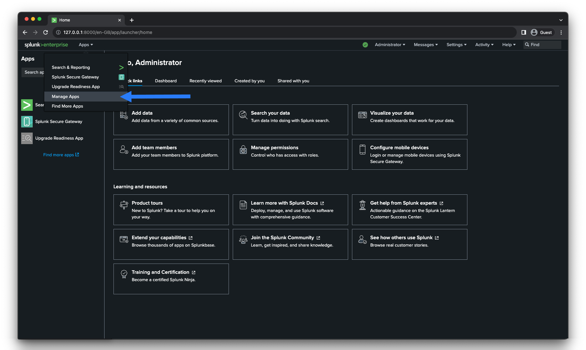 
2. Click **Install App from File**:    
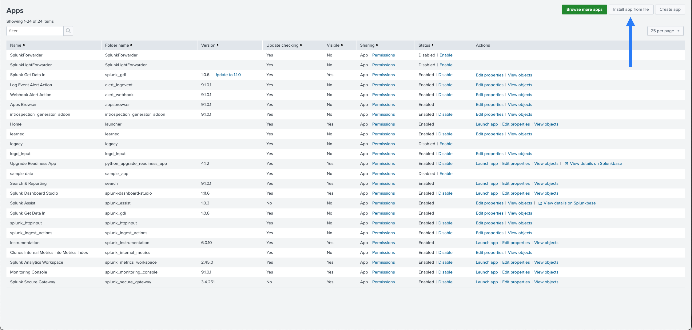 
3. Upload the file you've downloaded from Splunkbase:  
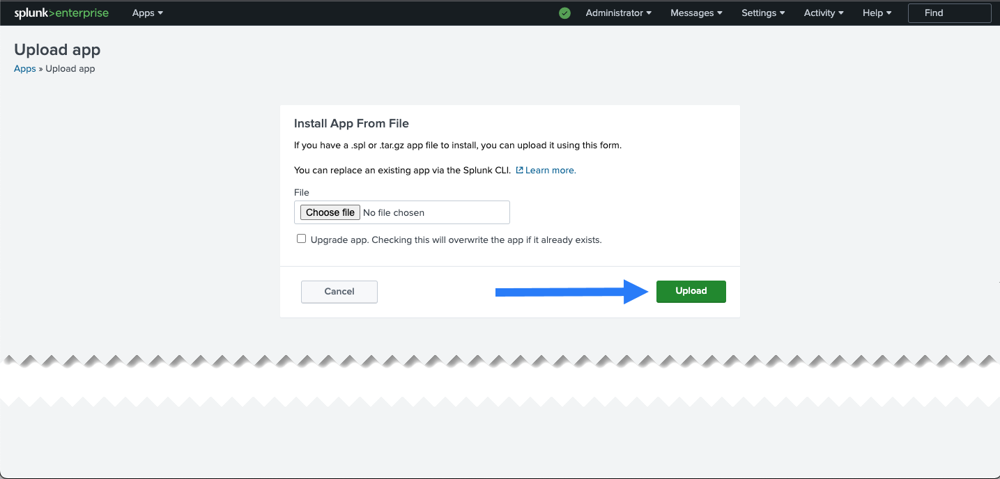 

After installation, the browser redirects you to the **Apps** page. This page now shows **Transmit Security** on the app list.  
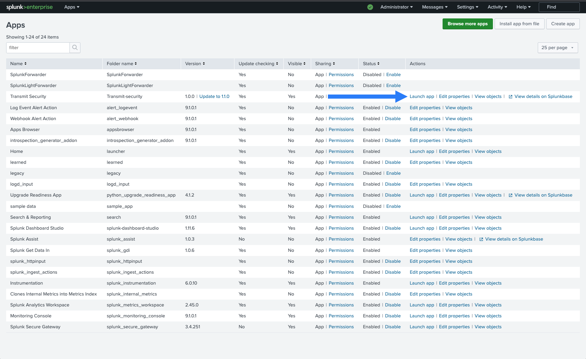  

## Step 3: Configure the inputs  

Now you need to launch the app and configure the following inputs:   

- Inputs for User Activity (logins, etc.) 
- Inputs for administrative audit logs: application created, group created, and so on

To configure the inputs: 

1. Launch the app from the **Apps** page.  
2. Click **Create New Input**: 
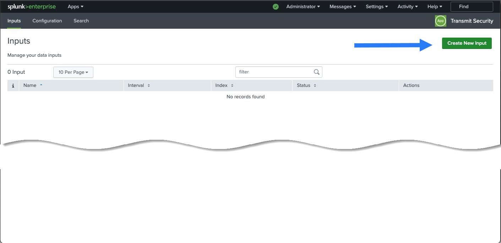  
3. Configure and update the User Activity inputs:  
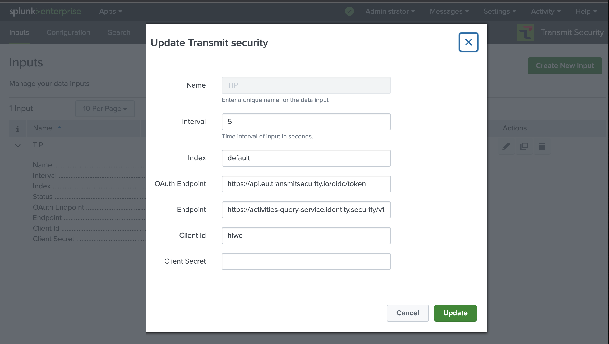  
    - **Name**: Give the input a meaningful name, for example, `Transmit_User_Events`.  
    - **Interval**: Enter polling interval in seconds.  
    - **Index**: Use your preferred index; for example, you can choose `default` or `main`.
    - **OAuth Endpoint**: Token exchange endpoint: `https://api.transmitsecurity.io/oidc/token` (`api.eu.transmitsecurity.io` for the EU and `api.ca.transmitsecurity.io` for Canada).  
    - **Endpoint** -  Use the following value: `https://activities.transmitsecurity.io/v1/activities/user` (`activities-query-service.identity.security` for the EU and `activities.ca.transmitsecurity.io` for Canada). 
    - **Client ID** and **Client Secret**: Use the values from the Management App you've created in the Transmit portal earlier. 
4. Repeat step 3 for the Admin Activity inputs. Use the endpoint `https://activities.transmitsecurity.io/v1/activities/admin` (update the base URL for EU / CA), and the same **Client ID** / **Client Secret** values as in step 3.  

!!! note
    When defining the polling interval, consider the level of activity on the platform. For instance, you may want to use a longer polling interval, like `3600` (1 hour), for low traffic or a shorter interval, like `300` (5 minutes), for high-traffic situations.  

## Step 4. Check the operation 

Check how the connector works using the **Search** app. Include `sourcetype=transmit` in the search bar. If the search isn't working, restart Splunk. 

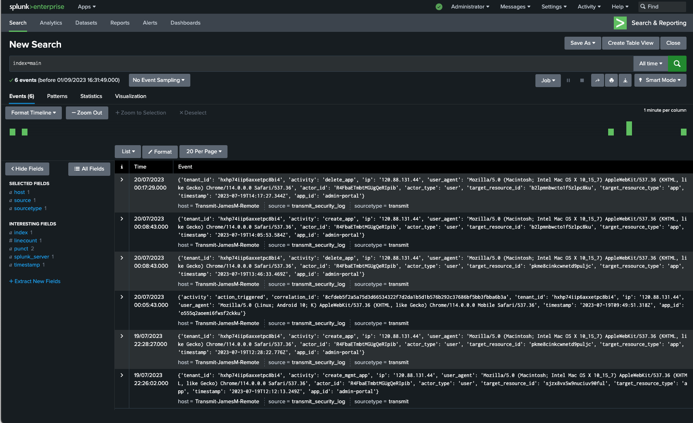  