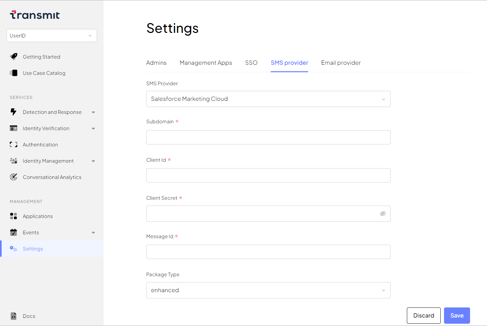

# Use custom SMS providers

To authenticate users or to verify their phone numbers, you can deliver one-time passcodes (OTPs) in SMS messages.  

## How it works  

By default, SMS messages are delivered via Transmit's own service, but you can configure the platform to send out SMS messages via Twilio, Salesforce Marketing Cloud (SMC), or other backend integrations. This feature may be useful if you already use a third-party SMS provider, when you investigate issues using the provider's logs, or when you need custom sender phone numbers. The configuration is set on a tenant's level.  

For example, you may wish to send SMS messages from local phone numbers, as they are often considered more credible.  

## Set up default SMS provider  

Go to **Settings** > **SMS provider**.  

If you choose **Default** under **SMS Provider**, the platform will dispatch all your SMS messages via Transmit's own SMS service. This option doesn't require additional configuration outside Transmit's APIs.  

## Set up Twilio

You can set up Twilio as your SMS provider from the Admin Portal. 

From **Settings** > **SMS provider**, select **Twilio** as the SMS provider and configure the following settings:  

- **Account SID**: your Twilio account SID
- **Auth Token**: your Twilio auth token
- **Sender setting**: Allows you to either configure the sender phone number directly, or the Messaging Service ID to use the sender settings configured for your Twilio [Messaging Service](https://www.twilio.com/docs/messaging/services)
  
!!! note
    After saving, you should verify that SMS messages are sent as expected.

  

## Set up Saleforce Marketing Cloud

You can set up Salesforce Marketing Cloud (SMC) as your SMS provider from the [Admin Portal](https://portal.transmitsecurity.io/).  

From **Settings** > **SMS provider**, select **Salesforce Marketing Cloud** as the SMS provider and configure the parameters:  

- **Subdomain**: Your Salesforce subdomain.  
- **Client ID**: Your [client identifier with Salesforce](https://help.salesforce.com/s/articleView?id=sf.remoteaccess_oauth_client_credentials_flow.htm&type=5) (also known as **Consumer key**).  
- **Client Secret**: Your [client secret with Salesforce](https://help.salesforce.com/s/articleView?id=sf.remoteaccess_oauth_client_credentials_flow.htm&type=5) (also known as **Consumer secret**).  
- **Message ID**: Your message identifier with Salesforce.  
- **Package Type**: The parameter enables you to choose legacy Salesforce packages. Default value: **enhanced**. Note that [Salesforce has ended support for legacy packages](https://help.salesforce.com/s/articleView?id=000380904&type=1).  

Visit [Salesforce: Safety Cloud](https://help.salesforce.com/s/articleView?id=sf.safety_cloud_and_marketing_cloud.htm&type=5) for further information. 

!!! note
    After saving the configuration, you should verify that SMS delivery works as expected.  

  

## Set up other SMS providers  

You can integrate with other custom SMS providers by implementing a gateway. This gateway should listen for messages from Transmit whenever you need to send an SMS. Once the gateway receives a message, it should forward it as an SMS through the provider you've set up on your end.

For a custom SMS gateway, you need to implement the following: 

- Two endpoints:  

    * POST endpoint for SMS processing  
    * GET endpoint for endpoint validation  
    
- One API call: register the endpoints with Transmit  

This setup will work in a manner similar to [webhooks]() where IAM Auth will push messages to your POST endpoint.  

To implement the SMS gateway:  

1. Create an endpoint for SMS processing. Upon an incoming POST request with SMS data, the endpoint should check the `X-API-Key` value (must match `api_key` in step 3), dispatch the SMS, and respond with a success code (`200`). Example incoming cURL request:  

```shell
# Example endpoint URI: "https://acme.com/send-sms"
curl --location --request POST '[GATEWAY_ENDPOINT_URI]' \ 
--header 'Content-Type: application/json' \ 
# API Key for endpoint registration (see step 3)  
--header 'X-API-Key: {API_KEY}' \ 
--data '{
    "phone_number": string,
    "sender_id": string,
    "message": string
}'
```  
2. Create an additional GET endpoint (at the same URL) that handles the validation challenge. This endpoint should be able to accept a GET request with payload like this: 

```shell
Accept: application/json, text/plain, */* \
content-length: 0 \
Host: example.com \
# API Key for endpoint registration (see step 3)
X-API-Key: abcd1234-0fae-4ce6-97c4-ca9ad4123b0d \ 
X-Scheme: https \
X-Verification-Key: AbCdZ3hJxx826qTmvwepy \
```  
Each validation request includes a random `X-Verification-Key` value in the header. The verification endpoint should extract this value and echo it back in the response body so Transmit can match the request and response. 

Here's an example implementation that can process the validation challenge:  

```js
app.define('/send-sms','GET', function(req, res) {

    // Retrieve the header value.
    var key = req.get("X-Verification-Key");
    // API key you register in step 3. 
    var my_api_key = "abcd1234-0fae-4ce6-97c4-ca9ad4123b0d";

    // Make sure that the API key in the request is the same you specify in step 3.
    if (req.get("X-API-Key") != my_api_key) {  return res.send(400, "Invalid request"); }

    // Set the response type.  
    res.type('application/json');

    // Set the status code of the response.
    res.status(200);

    // Send the key value in the response body. 
    res.json({  "key": key  });
}
```


After the validation challenge, register your endpoints on the platform. To do that, send a one-time request like this:    

```shell
curl --location --request PUT 'https://api.transmitsecurity.io/cis/v1/tenantsmsproviders' \
--header 'Content-Type: application/json' \
--header 'Authorization: Bearer{BEARER_TOKEN}' \
# Include the gateway details in the payload. 
# Example URI: "https://acme.com/send-sms"
--data '{
    "provider": "CustomGateway",
    "custom_gateway":{
        "uri": "{GATEWAY_ENDPOINT_URI}", 
        "api_key": "{API_KEY}" 
}'
```

Upon this request, Transmit updates your SMS provider configuration and responds with the validation challenge (see step 2). If the validation is successful, the platform will start delivering SMS messages to your POST endpoint (see step 1).  