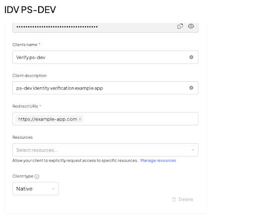

# IDV: Implement native webview using hosted experience  

!!! note
    You can integrate our Identity Verification (IDV) hosted application into a native Android or iOS application. To do so, implement `CustomTabs`/`WebView`on Android or `ASWebAuthenticationSession` on IOS.  
    For hybrid apps, we strongly recommend using the native Identity Verification SDKs ([Android]() or [IOS]()).

At a high level, the process includes the following steps:

1. Create a session
2. Present the session to the user
3. Handle a callback on session completion

In order to handle the callback, you’ll need to implement a mechanism (app links or custom schema links) through which your app can handle links.

## Step 1: Create a session  

To create your first identity verification session, you need to do the following:  

1. Create an app in the admin portal. See [Step 1](/guides/verify/quick_start_web/#step-1-create-your-app) in the hosted experience guide. 
2. Obtain an access token on your backend. See [Step 2](/guides/verify/quick_start_web/#step-2-get-access-token) in the hosted experience guide.
3. Use that access token to create a session. See [Step 3](/guides/verify/quick_start_web/#step-3-create-session) in the hosted experience guide. This will include the following:  
    3.1. The client will request the backend to create a session.  
    3.2. The backend response will contain a `start_token`. You can use this token to start the verification on the client side.  

Step 3 requires you to set the session `callback_url` value to a URL which will activate your app. See [Step 3: Handle completion callback](#step-3-handle-completion-callback) below for additional information.

For additional context, see the [Implement IDV hosted expirience](/guides/verify/quick_start_web.md).  

## Step 2: Present the session to user  

After creating your session, you need to direct your end user to the identity verification page: 

1. Use the `start_token` from the response (see API documentation for [this call](/openapi/verify/verifications/#operation/createSession!c=200&path=start_token&t=response)) to open the in-app browser tab. This is where the verification process will take place. Your options: 
    * On Android, you can implement `CustomTabs` or `WebView`.  
    * On IOS, use `ASWebAuthenticationSession`.  
2. Make sure the in-app browser points to our web app: `https://api.transmitsecurity.io/verify/app/{start_token}` 

<details>
<summary>Example `CustomTabs` Android implementation (Kotlin): </summary>

```kotlin
override fun onActivityResult(requestCode: Int, resultCode: Int, data: Intent?) {
   super.onActivityResult(requestCode, resultCode, data)
   if (requestCode == RESULT_CODE_CHROME_TABS) {
       if (resultCode == Activity.RESULT_CANCELED) {
           //handle user cancellation
       }
   }
}
private fun startCustomTabsActivity() {
   // Building the intent and starting the CustomTabsActivity
   val customTabIntent: Intent

   // Creating the custom tab intent builder and customizing the toolbar
   val customTabIntentBuilder = CustomTabsIntent.Builder()

   customTabIntentBuilder.apply {
       setUrlBarHidingEnabled(true)
   }

   customTabIntent = customTabIntentBuilder.build().intent
   customTabIntent.apply {
       // Note the updated base URL 
       data = Uri.parse("https://api.transmitsecurity.io/verify/app/" + [START_TOKEN])

       flags = Intent.FLAG_ACTIVITY_NO_HISTORY and
               Intent.FLAG_ACTIVITY_NEW_TASK and
               Intent.FLAG_ACTIVITY_SINGLE_TOP
   }

   startActivityForResult(customTabIntent, RESULT_CODE_CHROME_TABS)
```

</details>

<details>
<summary>Example `WebView` Android implementation (Kotlin): </summary>

```kotlin
webView.setWebViewClient(WebViewClient())

// Grant web view video capture permissions
webView.webChromeClient = object : WebChromeClient() {
    override fun onPermissionRequest(request: PermissionRequest) {
        if (Build.VERSION.SDK_INT >= Build.VERSION_CODES.LOLLIPOP) {
            for (r in request.resources) {
                if (r == PermissionRequest.RESOURCE_VIDEO_CAPTURE) {
                    request.grant(arrayOf(PermissionRequest.RESOURCE_VIDEO_CAPTURE))
                    break
                }
            }
        }
    }
}

val webSettings: WebSettings = webView.getSettings()
webSettings.javaScriptEnabled = true
webSettings.allowFileAccess = false
webSettings.mediaPlaybackRequiresUserGesture = false
// Note the updated base URL
webView.loadUrl("https://api.transmitsecurity.io/verify/app/" + [START_TOKEN]) 
```

</details>

<details>
<summary>Example `ASWebAuthenticationSession` IOS implementation (Swift): </summary>

```swift
private var authSession: ASWebAuthenticationSession?
    
@IBAction func startVerification() {
    let redirectUrl = "YOUR_REDIRECT_URL"
    let startToken = "START_TOKEN_FROM_CREATE_SESSION"
   	// Note the updated base URL 
    let verifyUrl = URL(string: "https://api.transmitsecurity.io/verify/app/\(startToken)")!
    let callBackScheme = URL(string: redirectUrl)!.scheme
   	 
    self.authSession = ASWebAuthenticationSession(
        url: verifyUrl,
        callbackURLScheme: callBackScheme,
        completionHandler: { [weak self] (callBack: URL?, error: Error?) in
            // obtain the `sessionId` and `state` from callBack
    })
   	 
    self.authSession?.presentationContextProvider = self
    self.authSession?.start()
}
    
// MARK: ASWebAuthenticationPresentationContextProviding
    
func presentationAnchor(for session: ASWebAuthenticationSession) -> ASPresentationAnchor {
    return topMostViewController ?? ASPresentationAnchor()
} 
```

</details>

After opening the in-app browser, the user will interact with our web app and take the required pictures to complete the session.  

## Step 3: Handle completion callback  

When the identity verification process completes, our web app will trigger a redirect to the `callback_url` value that you specified when you created a session. 

On Android, that callback URL should point to your app, via [deep links](https://developer.android.com/training/app-links/deep-linking) or [app links](https://developer.android.com/training/app-links). 

For iOS, you may handle the callback URL directly, using the `completionHandler` as explained below. If you implement the web experience without using the `ASWebAuthenticationSession` component, you may handle the callback via [universal link](https://developer.apple.com/ios/universal-links/). 

Depending on the operating system and app configuration, you may want to close the in-app browser after receiving the callback. Otherwise, it could still be accessible via the back button. 

When processing the callback, note the `session_id` and `state` params. You’ll need to pass those params to your backend:

- Use the `state` value to validate that the server is familiar with the current session.  
- Use the `session_id` value to fetch the session result.  

See the results section (step 5 of the [IDV hosted experience guide](/guides/verify/quick_start_web/#step-5-get-verification-result)) and the [API reference](/openapi/verify/verifications/#operation/getResult) for more details.  

## Required permissions 

### Android permissions 

The following permissions should be generated for native Android WebView:

- `android.permission.INTERNET`: This permission allows the app to access the Internet.
- `android.permission.CAMERA`: This permission allows the app to use the device's camera.

### iOS permissions  

Your app requires camera permissions in order to capture the images required for the verification process.
Open the `Info.plist` file as a Property List and add the following key: **Privacy** - **Camera Usage Description**. The key value contains an explanation for why the permission is needed, which will be displayed to the user to approve. For example: `This is needed to capture images for the verification process`.

## Implementation notes

### IOS implementation notes  

Parse the `callBack` received upon handling (`completionHandler`) of the `ASWebAuthenticationSession`. 

```swift
self.authSession = ASWebAuthenticationSession(
        url: verifyUrl,
        callbackURLScheme: callBackScheme,
        completionHandler: { [weak self] (callBack: URL?, error: Error?) in
            // Next up, obtain the `sessionId` and `state` from the callBack
})
```

### Android implementation notes  

Update the Application Manifest to support deep linking, which is required to return to the application once the verification process has been completed. The deep link will correspond to the callback URL defined in your journey configuration.
Add this snippet to the Android Application manifest inside the application tag.

```swift 
<activity android:name="YourActivity">
    <intent-filter>
        <action android:name="android.intent.action.VIEW" />
        <category android:name="android.intent.category.DEFAULT" />
        <category android:name="android.intent.category.BROWSABLE" />
        <data
        android:host="yourhostname"
        android:scheme="yourschemename" />
    </intent-filter>
</activity>
```

!!! note
    You need to replace `yourhostname` and `yourschemename` with your host name and scheme. This will result in a deep link that looks like: `yourschemename://yourhostname`.

### Android troubleshooting  

#### Issue: Denied starting an intent without a user gesture  

Android does not let the WebView to start an app intent without an explicit user action.  This happens when the redirect URI has a web protocol (`http`/`https`). 
Make sure the redirect URI you define is proprietary `schema://host`. Example: `myapp://identity-verification`

#### Issue: Incorrect redirect URIs

The **console app redirect URI** and **client-side redirect URI** are not the same thing:  

* **Console app redirect URI** should follow the web protocol (`http`/`https`).  
* **Client-side redirect URI** should be defined as proprietary `schema://host`, for example, `myapp://identity-verification`. This should be the same URI that your backend passes as a `callback_url` in the verification API.

  

## Known issues  

### Native IOS - WebKit Bug 253186

IOS 16.4 - See [WebKit Bug 253186 - REGRESSION iOS 16.4 beta selects ultra-wide for facingMode: environment](https://bugs.webkit.org/show_bug.cgi?id=253186).  

16.4 beta selects ultra-wide for `facingMode: environment`. When the user tries to take a picture of the document, he need to move the device closer or further away to find the ideal focus of the card. By choosing the wide angle camera the user will need to move further away from the document.    

### Native Android: Webview Chromium issue 669492 

For native android WebView, there is a known bug, which takes the default camera of the device (which is a the wide lens camera) due to some permissions restrictions, that need to be aware of. This bug affects some Android devices. 

Official name: [Issue 669492: Android WebView chromium is giving empty label and kind fields in MediaDeviceInfo, when enumerateDevices() is called.](https://bugs.chromium.org/p/chromium/issues/detail?id=669492)  
 
This is an Android bug that can only be resolved by Android. We highly recommend using a solution with custom tabs to avoid this issue. 