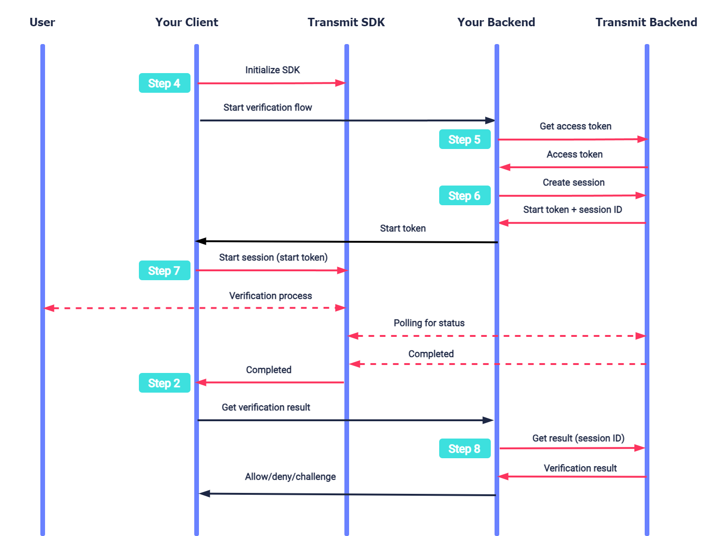

# IDV: Implement IDV through Web SDK 

Using our identity verification (IDV) APIs, you can reliably check your customers' identity against their documents, for example, a driver’s license or a passport. After successful check, you can enable their further transactions, for example, allowing them to open a new bank account online or to pick up a rental car. 

Follow this guide to integrate Transmit IDV into your website.

!!! note
    If you use Transmit's hosted identity experience, follow a different guide: [Web quick start for a hosted experience](). 

## How it works

Here's an example of an IDV process. Interaction with Transmit APIs is shown in pink; the table also shows related integration  steps.

After initializing the SDK ([Step 4](#step-4-initialize-the-sdk)), your backend continues by getting an access token ([Step 5](#step-5-get-access-token)) and creating a session ([Step 6](#step-6-create-session)). After this, your client starts a session ([Step 7](#step-7-start-session)). The SDK executes the verification process with the user using the Transmit identity verification experience. Once all the required images are submitted, Transmit starts processing the verification while the SDK polls for its status. Once processing is completed, the SDK notifies the app ([Step 2](#step-2-implement-callback)) so it can obtain the verification result ([Step 8](#step-8-get-verification-result)).  

The diagram below maps the IDV process stages with the required implementation steps:  

  

## Step 1: Configure your app

To integrate your app with Transmit, you'll need to configure an application in the Admin Portal.  

From the [Applications](https://portal.transmitsecurity.io/applications) page, [create an application](/guides/user/create_new_application.md) or use an existing application. Enter the following settings:  

1. For **Client type** , select **Web**.  
2. For **Redirect URI** , enter your website URL. This is a required field.  

Your client ID and client secret for API calls are auto generated once you've created the app.  

## Step 2: Implement callback 

After starting the session (see [Step 7: Start session](#step-7-start-session)), the verification moves through different events and statuses. For example, the status will indicate if the process was completed successfully so the backend can fetch the verification result. For every change, the SDK will invoke a callback method defined by your application. You need to implement these callback methods.  

```javascript
const sdkCallBacks = {
  // Notifies when user has started an image capturing session.
  sessionStarted: ({ sessionId }) => {},

  // Notifies when user has uploaded an image. 
  imageSubmitted: ({ sessionId }, type) => {},

  // Notifies when user has finished uploading images and the verification has started.
  processing: ({ sessionId }) => {},  

  // Notifies when verification process completed, and the result can be obtained (via backend request).
  completed: ({ sessionId }) => {},

  // Notifies when we require re-capturing an image.
  recapture: ({ sessionId }) => {},

  // Nofities when an error occurs.
  error: ({ sessionId }, error) => {},
};
```


## Step 3: Load SDK

To load the SDK, include the following HTML script tag in all the relevant pages of your front-end web application:

```html
<script src="https://platform-websdk.transmitsecurity.io/platform-websdk/latest/ts-platform-websdk.js" defer="true" id="ts-platform-script"></script>
```

Then add the code below to wait for the SDK loading event:

```javascript
document.getElementById('ts-platform-script').addEventListener('load', () => {
  // do here things with `tsPlatform`
});
```

## Step 4: Initialize the SDK

Configure the SDK globally for all the modules by calling the SDK's `initialize()` method, as in the example below:

```javascript
// Configures the SDK with your client ID from Step 1 and initial verification params
window.tsPlatform.initialize({ clientId: [CLIENT_ID], IDV: {
  serverPath: "https://api.transmitsecurity.io/verify", // Use api.eu.transmitsecurity.io for EU clusters
  consentVersion: "[CONSENT_VERSION]", // ID of the consent document approved by the user
  callbacks: [CALLBACKS], // Callback methods implemented in Step 2
}});
```

!!! note
    - The SDK should be initialized only once on each relevant page.
    - The ID of the consent document is stored by Transmit (see [User consent for identity verification](/guides/verify/idv_user_consent.md)).
    - By default, the verification UI will be available in English. However, the IDV object supports a `language` param, which can also be set to `pt` for Portuguese or `es` for Spanish.
    - The IDV object supports an optional `rootElement` string param to specify the ID of a DIV container with the SDK's IDV GUI. If unspecified, the SDK will insert a new DIV container with IDV GUI elements inside the HTML body.  

## Step 5: Get access token

An access token is required to authorize the backend API calls, such as for [creating a verification session](#step-6-create-session) and [obtaining the result](#step-8-get-verification-result). When needed, obtain an access token using the `/token` request below. See the [Get client access tokens](https://developer.transmitsecurity.com/guides/user/retrieve_client_tokens/) guide for more information. 


```javascript
import fetch from 'node-fetch';

async function run() {
  const formData = {
    client_id: '[CLIENT_ID]', // Replace with client ID obtained in Step 1
    client_secret: '[CLIENT_SECRET]', // Replace with client secret obtained in Step 1
    grant_type: 'client_credentials',
    resource: 'https://verify.identity.security'
  };
  const resp = await fetch(
    `https://api.transmitsecurity.io/oidc/token`, // Use api.eu.transmitsecurity.io for EU clusters
    {
      method: 'POST',
      headers: {
        'Content-Type': 'application/x-www-form-urlencoded'
      },
      body: new URLSearchParams(formData).toString()
    }
  );
  const data = await resp.text();
  // Process the response
}
run();
```

## Step 6: Create session

Before your app can initiate the verification process, your backend must create a session in order to provide a secure context for the flow. Create a session by sending a `/v1/verification` request.

```javascript
import fetch from 'node-fetch';

async function run() {
  const resp = await fetch(
    'https://api.transmitsecurity.io/verify/api/v1/verification', // Use api.eu.transmitsecurity.io for EU clusters
    {
      "method": "POST",
      "headers": {
        "Content-Type": "application/json",
        "Authorization": "Bearer <YOUR_JWT_HERE>" // Replace with access token obtained in Step 3
      }
    }
  );
  const data = await resp.json();
  // Process the response
}
run();
```

The response contains a `start_token` that will be used to start the verification on the client side (in [Step 7: Start Session](#step-7-start-session)), and the `session_id` required to obtain the [verification result](#step-8-get-verification-result). 
For example:

```json
{
  "start_token": "ca766ed78c8c0b7824dfea356ed30b72",
  "session_id": "H1I12oskjzsdhskj4",
  "expiration": "2023-07-18T09:57:46.950Z",
  "missing_images": [
    "document_front",
    "document_back",
    "selfie"
  ]
}

```

## Step 7: Start session

Once a session is created, initiate the verification process using the `start()` SDK method. Add the code below to your app, passing the `start_token` value returned in the previous step. If successful, the SDK will start a verification process for the user and guide them through the entire identity verification flow using the Transmit experience.
Calling this method will add the verification UI to the DOM, allowing the user to start the verification process, and activate a callback method with data indicating the status of the verification (see [Step 2: Implement callback](#step-2-implement-callback)). 

```javascript
window.tsPlatform.idv.start(startToken);
```

## Step 8: Get verification result

Once the verification process starts, your application can track it using the callback methods implemented in step 2.

After all the required images are successfully submitted, Transmit automatically starts processing the verification and the SDK starts polling to check the status. If the status is `completed`, your backend should send the request below to obtain the verification result (see [Get verification results API reference](https://developer.transmitsecurity.com/openapi/verify/verifications/#operation/getResult)):

```javascript
import fetch from 'node-fetch';

async function run() {
  const sid = '[SESSION_ID]'; // Replace with session ID returned in Step 7
  const resp = await fetch(
    `https://api.transmitsecurity.io/verify/api/v1/verification/${sid}/result`, // Use api.eu.transmitsecurity.io for EU clusters
    {
      method: 'GET',
      headers: {
        Authorization: 'Bearer [ACCESS_TOKEN]' // Replace with access token obtained in Step 6
      }
    }
  );

  const data = await resp.text();
  // Process the response 
}
run();
```

## Step 9: Handle verification result

Your service should define the user experience based on the verification result, indicated by the `recommendation` field:  

- If `ALLOW`: the identity verification process was completed successfully. The response includes user details collected from the document (like their name and birthday), which can be used to enrich the user's profile, and details about the document used to prove their identity.    
- If `CHALLENGE`: the identity verification process didn’t succeed, since at least one verification check didn’t pass. The response includes extracted (yet unverified) info and indicates which checks didn't pass and why. This info can be used to review unsuccessful sessions or analyze failed verification attempts. You should proceed as suitable for your use case, typically by initiating a manual review process.  
- If `DENY`: the identity verification indicates a high likelihood of attempted fraud. The response includes the extracted (yet unverified) info and indicates which checks didn't pass and why. You should block the user or initiate an in-depth manual review to avoid onboarding a fraudulent user.  

Collected information is arranged inside nested objects: `person`, `document`, and `additional_info`.   

Besides the composite verification result, the response provides information about individual checks inside the nested `checks` object.  

<details>

<summary>Response example for successful ID verification:  </summary>

```json

{
  "session_id": "H1I12oskjzsdhskj4",
  "status": "complete",
  "recommendation": "ALLOW",
  "person": {
    "full_name": "Marie Salomea Skłodowska-Curies",
    "given_name": "Marie",
    "surname": "Curies",
    "national_id": "123ABC",
    "date_of_birth": "1867-11-07T00:00:00.000Z"
  },
  "document": {
    "country": "US",
    "region": "NY",
    "type": "national_id",
    "number": "1234567",
    "serial_number": "1234567",
    "issue_date": "1867-11-07T00:00:00.000Z",
    "expiration_date": "1867-11-07T00:00:00.000Z"
  },
  "additional_info": {
    "address": {
      "country": "USA",
      "region": "Indiana",
      "city": "Indianapolis",
      "street": "Snowy Ridge Road",
      "house_number": "1234",
      "apartment_number": "12",
      "postcode": "56789",
      "full_address": "1234 Snowy Ridge Road Indianapolis, IN 56789"
    },
    "national_status": {
      "citizen": true,
      "resident": true
    },
    "employment": {
      "profession": ""
    }
  },
  "checks": {
    "document_validation": {
      "recommendation": "ALLOW"
    },
    "document_authentication": {
      "recommendation": "ALLOW"
    },
    "document_liveness": {
      "recommendation": "ALLOW"
    },
    "biometric_matching": {
      "recommendation": "ALLOW"
    },
    "biometric_liveness": {
      "recommendation": "ALLOW"
    },
    "flagged_identity": {
      "recommendation": "ALLOW"
    },
    "risk_recommendation": {
      "recommendation": "ALLOW"
    }
  }
}
```

</details>

If ID verification fails, the response indicates the reasons behind it. 

<details>

<summary>Response example for unsuccessful ID verification:  </summary>

```json
{
  "session_id": "string",
  "status": "complete",
  "recommendation": "DENY",
  // EXTRACTED DATA...
  "checks": {
    "document_validation": {
      "recommendation": "ALLOW"
    },
    "document_authentication": {
      "recommendation": "ALLOW"
    },
    "document_liveness": {
      "recommendation": "DENY",
      "reasons": [ "presentation_attack" ]
    },
    "biometric_matching": {
      "recommendation": "CHALLENGE",
      "reasons": [ "biometric_mismatch" ]
    },
    "biometric_liveness": {
      "recommendation": "DENY", 
      "reasons": [ "mask detected" ]
    },
    "flagged_identity": {
      "recommendation": "DENY",
      "reasons": [ "multiple_same_identity_attempts" ]
    },
    "risk_recommendation": {
      "recommendation": "DENY",
      "reasons": [ "action_is_suspected_fraud" ]
    }
  }
}
```
</details>

## Step 10: Recapture the images  

Recapture the required images in case the recapture status is returned. For example, if some data can't be extracted because of poor image quality.
User will return to the beginning of the flow and go through the verification process again. Data regarding their stage will be delegated to a callback method.

```javascript
window.tsPlatform.idv.recapture(sessionId);
```

## Example HTML implementation  

```html
<html>

<head>
  <title>IDV Demo</title>
  <meta name="viewport" content="width=device-width, initial-scale=1.0">
</head>

<body style="margin: 0;">
  <button id="start-verification">start</button>
  <script src="https://platform-websdk.transmitsecurity.io/platform-websdk/latest/ts-platform-websdk.js" defer="true"
    id="ts-platform-script"></script>
  <script>
    const sdkCallBacks = {
      sessionStarted: ({ sessionId }) => {},
      imageSubmitted: ({ sessionId }, type) => {},
      processing: ({ sessionId }) => {},
      completed: ({ sessionId }) => {},
      recapture: ({ sessionId }) => {},
      error: ({ sessionId }, error) => {},
    };

    document.getElementById('ts-platform-script').addEventListener('load', () => {
      const sdkInit = {
        clientId: 'abcdefg',
        IDV: {
          consentVersion: '123456',
          serverPath: 'http://localhost:3030/verify',
          language: 'en',
          rootEelement: 'sdk-root-container',
          callback: sdkCallBacks,
        },
      };
      window.tsPlatform.initialize(sdkInit);
    });

    document.getElementById("start-verification").addEventListener("click", (event) => {
      window.tsPlatform.idv.start(jsonRes.startToken)
    });

  </script>
</body>

</html>
```  